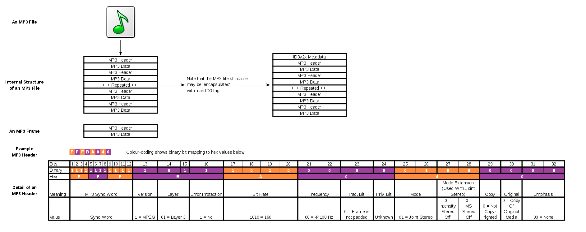

# Music
> parse the cached music in /netease/cloudmusic/Cache/Music1/*.mp3.uc!  ---> mobile phone  
> 参考:  
[MP3文件结构解析](https://blog.csdn.net/u010650845/article/details/53520426)
[MP3标签 ID3v1,ID3v2,APETAGEX](https://blog.csdn.net/liuyan4794/article/details/7747769)

## MP3文件

<!-- -->
  
MP3文件大体上分为三个部分：ID3V2+音频数据+ID3V1  


## ID3V2解析
ID3V2一共有四个版本，ID3V2.1/2.2/2.3/2.4，目前流行的播放软件一般只支持第三版即ID3V2.3，由于ID3V1记录在文件的末尾处，ID3V2就只能记录在文件的首部了，也是因为这个原因，对ID3V2的操作比ID3V1要慢，而且ID3V2的结构比ID3V1的结构复杂的多，但是ID3V2可以记录更多的信息，长度可变

### ID3V2.3解析
ID3V2.3由一个标签头和若干个标签帧或者一个扩展标签头组成，至少要有一个标签帧，每一个标签帧记录一种信息，例如作曲、标题等

### ID3V2.3标签头
位于文件开始处，长度为10字节，结构如下：
```c++
byte Header[3];    /* 必须为"ID3"否则认为标签不存在 */
byte Ver;         /* 版本号ID3V2.3 就记录3 */
byte Revision;     /* 副版本号此版本记录为0 */
byte Flag;        /* 标志字节，只使用高三位，其它位为0 */
byte Size[4];      /* 标签大小 */
```

注：~~标签大小，不能确定具体包括哪些内容，解析歌曲文件后，发现没有哪些字节之和会等于该值，~~详见下面的实例分析  
**标志字节**一般为0，定义如下(abc000000B)  
a：表示是否使用Unsynchronisation  
b：表示是否有扩展头部，一般没有，所以一般也不设置  
c：表示是否为测试标签，99.99%的标签都不是测试标签，不设置  
**标签大小**共四个字节，每个字节只使用低7位，最高位不使用恒为0，计算时将最高位去掉，得到28bit的数据，计算公式如下：  
`Size=(Size[0]&0x7F)*0x200000+(Size[1]&0x7F)*0x400+(Size[2]&0x7F)*0x80+(Size[3]&0x7F)
`
### ID3V2.3标签帧
标签内容由若干个标签帧组成。
**每个标签帧都由一个10个字节的帧头和至少 1个字节的不固定长度的帧内容组成，它们顺序存放在文件中。**
每个帧都由帧头和帧内容组成，数据结构如下：  

| 名称 | 字节 | 介绍 |
| :--- | :--- | :--- |
| FrameId | 4 | **帧标识符的Ascii码，常用标识符** |
| Size  |  4 | 帧内容及编码方式的合计长度，高位在前 |
| Flags | 2  | 标志，只使用了6位，详见表6，一般均＝0  |
| encode | 4 | 帧内容所用的编码方式。许多帧没有此项  |
| 帧内容 |   |  至少 1 个字节  |

说明：  
- Size的计算:由于当前byte,所有bit均为有效位，因此---转换为int
- 标签帧之间没有特殊的分隔符，要得到一个完整的标签帧内容必须先从帧头中得到帧内容长度。
- encode 有 4 个可能值：  
     0：表示帧内容字符用` ISO-8859-1 `编码；  
     1：表示帧内容字符用` UTF-16LE `编码；  
     2：表示帧内容字符用` UTF-16BE `编码；  
     3：表示帧内容字符用` UTF-8 `编码（仅ID3V2.4才支持）    
`但经常看到的是"eng"这样的字符形式，它表示帧内容所使用的自然语言为英语。`也许 D3V2 标签帧进化到现在，encode 已经用“自然语言”取代了“编码方式”。
- 帧内容均为字符串，常以 00 开头。

#### 标签帧标识符的意义  
| 名称 | 意义     |
| :---- | :--- |
|AENC | 音频加密技术 |
|APIC | 附加描述 |
|COMM | 注释，相当于ID3v1的Comment |
|COMR | 广告 |
|ENCR | 加密方法注册 |
|ETC0 | 事件时间编码 |
|GEOB | 常规压缩对象 |
|GRID | 组识别注册 |
|IPLS | 复杂类别列表 |
|MCDI | 音乐CD标识符 |
|MLLT | MPEG位置查找表格 |
|OWNE | 所有权 |
|PRIV | 私有 |
|PCNT | 播放计数 |
|POPM | 普通仪表 |
|POSS | 位置同步 |
|RBUF | 推荐缓冲区大小 |
|RVAD | 音量调节器 |
|RVRB | 混响 |
|SYLT | 同步歌词或文本 |
|SYTC | 同步节拍编码 |
|TALB | 专辑，相当于ID3v1的Album |
|TBPM | 每分钟节拍数 |
|TCOM | 作曲家 |
|TCON | 流派（风格），见表2 |
|TCOP | 版权 |
|TDAT | 日期 |
|TDLY | 播放列表返录 |
|TENC | 编码 |
|TEXT | 歌词作者 |
|TFLT | 文件类型 |
|TIME | 时间 |
|TIT1 | 内容组描述 |
|TIT2 | 标题，相当于ID3v1的Title |
|TIT3 | 副标题 |
|TKEY | 最初关键字 |
|TLAN | 语言 |
|TLEN | 长度 |
|TMED | 媒体类型 |
|TOAL | 原唱片集 |
|TOFN | 原文件名 |
|TOLY | 原歌词作者 |
|TOPE | 原艺术家 |
|TORY | 最初发行年份 |
|TOWM | 文件所有者（许可证者） |
|TPE1 | 艺术家相当于ID3v1的Artist |
|TPE2 | 乐队 |
|TPE3 | 指挥者 |
|TPE4 | 翻译（记录员、修改员） |
|TPOS | 作品集部分 |
|TPUB | 发行人 |
|TRCK | 音轨（曲号），相当于ID3v1的Track |
|TRDA | 录制日期 |
|TRSN | Intenet电台名称 |
|TRSO | Intenet电台所有者 |
|TSIZ | 大小　 |
|TSRC | ISRC（国际的标准记录代码） |
|TSSE | 编码使用的软件（硬件设置） |
|TYER | 年代，相当于ID3v1的Year |
|TXXX | 年度 |
|UFID | 唯一的文件标识符 |
|USER | 使用条款 |
|USLT | 歌词 |
|WCOM | 广告信息 |
|WCOP | 版权信息 |
|WOAF | 官方音频文件网页 |
|WOAR | 官方艺术家网页 |
|WOAS | 官方音频原始资料网页 |
|WORS | 官方互联网无线配置首页 |
|WPAY | 付款 |
|WPUB | 出版商官方网页 |
|WXXX | 用户定义的URL链接 |

说明：
- 帧内容是数字的，都用 Ascii 字符表示。
- 有的 TCON（风格、流派）的帧内容是直接用字符串表示的，如“genre”，而有的则是用编号表示的，如“28 31 32 29”就是用字符串“(12)”表示 12 号风格，我们在解析的时候要注意。
- TRCK（音轨）的帧内容格式是：N/M。其中，分母表示专辑中共有 M 首歌曲，分子表示专辑中的第 N 首曲。

#### 标签帧中Flags标志的意义

| 位址 | 意义 |
| :--- | :--- |
| 0 | 标签保护标志，如设置表示此帧作废 |
| 1 | 文件保护标志，如设置表示此帧作废 |
| 2　| 只读标志，如设置表示此帧不能修改 |
| 3　| 压缩标志，如设置表示1个字节存放2个BCD码表示数字 |
| 4　| 加密标志 |
| 5　| 组标志，如设置表示此帧和其它的某帧是一组 |


## 音频数据解析  
每个帧都有一个帧头，长度是四个字节，帧后面可能有2字节的CRC校验，取决于帧头的第16位，为0则无校验，为1则有校验，后面是可变长度的附加信息，对于标准的MP3文件来说，其长度是32字节，紧接其后的是压缩的声音数据，当解码器读到此处时就进行解码了。  
    
数据帧帧头
帧头长4字节，结构如下：
```c
typedef FrameHeader
{
unsigned int sync:11;                        //同步信息
unsigned int version:2;                      //版本
unsigned int layer: 2;                           //层
unsigned int error protection:1;           // CRC校验
unsigned int bitrate_index:4;              //位率
unsigned int sampling_frequency:2;         //采样频率
unsigned int padding:1;                    //帧长调节
unsigned int private:1;                       //保留字
unsigned int mode:2;                         //声道模式
unsigned int mode extension:2;        //扩充模式
unsigned int copyright:1;                           // 版权
unsigned int original:1;                      //原版标志
unsigned int emphasis:2;                  //强调模式
}HEADER, *LPHEADER;
```

